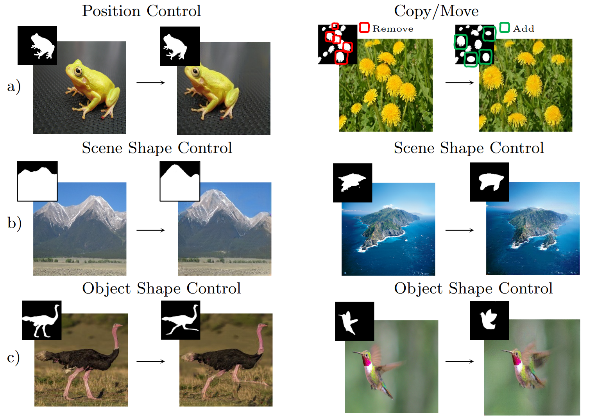
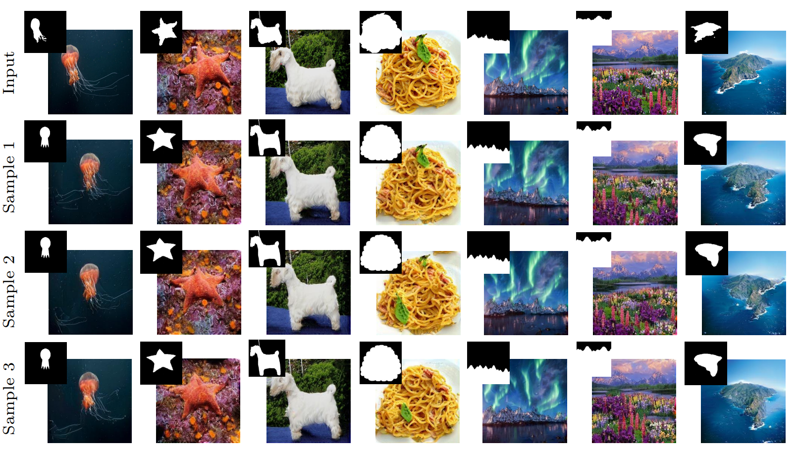

# MAGIC: Mask-Guided Image Synthesis by Inverting a Quasi-Robust Classifier

Official Pytorch implementation of the following paper (will be uploaded soon):

+ Rouhsedaghat M, Monajatipoor M, Kuo CC, Masi I. [MAGIC: Mask-Guided Image Synthesis by Inverting a Quasi-Robust Classifier](https://arxiv.org/abs/2209.11549). AAAI23

___

  

MAGIC allows a diverse set of image synthesis tasks following the semantic of objects and scenes requiring a single image, its binary segmentation source mask, and
a target mask. In each pair, the left image is the input, and the right one is the manipulated image, guided by the mask shown on top. a) position control and copy/move manipulation; b) shape control on object (non repetitive); c) shape control on  scene (repetitive) images.

  

For each input, we fix the mask and start the synthesis from three different starting points while observing the boundaries specified by the target mask and generating realistic images, MAGIC keeps specificity and generates diverse results.
___

### Requirements

The code is tested in a vertual environment with Python 3.6 and pytorch 1.3.1 on NVIDIA NVIDIA Quadro M600 GPU.
The version of all other required libraries is available in requirements.txt.

### Running the code

First, store the training image in `inputs` as x.jpg and its corresponsing training binary mask as gt_x.jpg in `labels`. Then, place the target mask(s) as target#num_x.jpg in `labels`. #num can be any number, e.g., target1_x.jpg, target2_x.jpg, etc.

Finally run the below code:

`
python train.py --gpu 5 --save_prefix results_ --mode synthesis --target_prefix #num --setting_id 2 --pre_w resnet50-l2-eps0.05.ckpt --file_name x
`

___
This repository is in its initial stage, please report bugs to rouhseda@usc.edu

Thanks~
